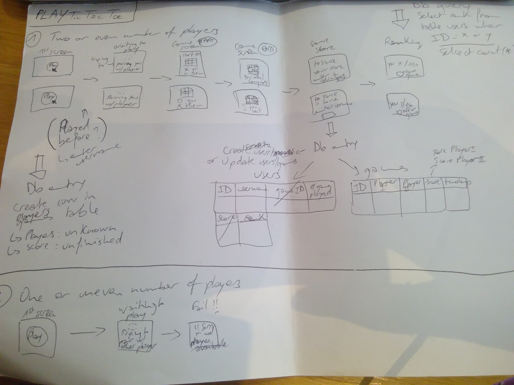

## frontend-ttt
Reusing a Python Websockets example for a chat. See [link](https://devcenter.heroku.com/articles/python-websockets)

This is a simple application that serves WebSockets to your users with Flask, Flask-Sockets, Gevent, and Gunicorn.

Check out the [live demo](http://flask-chat.herokuapp.com) or [read the docs](https://devcenter.heroku.com/articles/python-websockets).

### General description

The whole TicTacToe game would be organised as such

When one player clicks to play:

1) Either another player is available to play
* the `start-game` url of [backend-ttt](https://github.com/Eleonore9/backend-ttt) is called to createnew players and new game row
* the two players play the game (using this web socket app)
* the game ends when one player wins
* the players are prompted for their usernames -> data including usernames and the id of the winner are sent to the `finish-game` url to update the players and games tables
* then the players are redirected to the ranking page -> data for the ranking to displayed is retrieved by calling the `global-ranking` with a player's id

2) Or there is no other player
-> "failure" message + button to click and check again for another player

### Future features

The aim is for this app to work with [backend-ttt](https://github.com/Eleonore9/backend-ttt) to create a game of TicTacToe.

* a UI would get players inputs
* web sockets would enable the players inputs to be communicated to each other
* a game logic like this [implementation](https://gist.github.com/rpip/5608979) would enable the players to play. This would need to be modified:
  * for the player interaction messages to be send over the web sockets
  * for the board evolution to be reflected via the web UI
  * for the player and game information at the start and end of the game to be sent to the [backend-ttt](https://github.com/Eleonore9/backend-ttt) by requesting the `start-game`, `finish-game` and `global-ranking` urls
